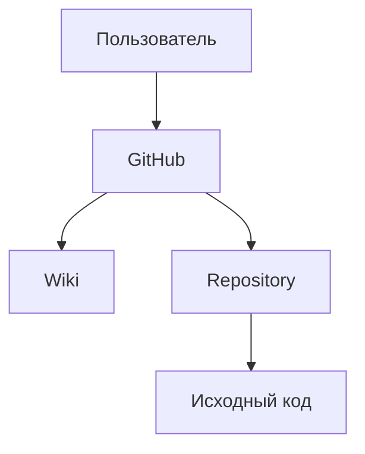

# software-engineering-lab
Тестовый проект (МИРЭА, Программная инженерия)

# Лабораторная работа №2

## Документация проекта

Добро пожаловать в раздел документации проекта.

## Содержание

1. [Наша команда](Our-team.md)
2. [События января](Docs/Предстоящие-события/События-Января.md)
3. [События февраля](Docs/Предстоящие-события/События-Февраля.md)

## Структура документации

```text
Docs/
├── README.md
├── Our-team.md
└── Предстоящие-события/
    ├── События-Января.md
    └── События-Февраля.md
```

## Используемые технологии
- Git
- GitHub
- Markdown

и еще (может быть):


## Пользователи:

## Формула
$$
S = \pi r^2
$$

## План работы
- [x] Создать GitHub-репозиторий
- [x] Создать Wiki
- [x] Добавить документацию
- [ ] Добавить диаграмму
- [ ] Провести тестирование
