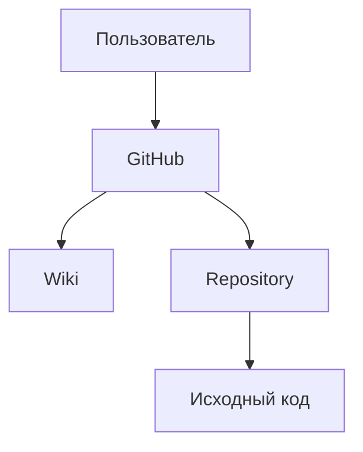

# software-engineering-lab
Тестовый проект (МИРЭА, Программная инженерия)

# Лабораторная работа №1

## Тема
Создание проекта и организация совместной работы в GitHub

## Цель работы
Получение практических навыков использования GitHub для
хранения исходного кода, документирования проекта и
организации совместной работы.

## Используемые технологии
- Git
- GitHub
- Markdown

и еще (может быть):


## Структура проекта

```text
software-engineering-lab/
├── README.md
└── docs/
```

## Пользователи:

## Формула
$$
S = \pi r^2
$$

## План работы
- [x] Создать GitHub-репозиторий
- [x] Создать Wiki
- [x] Добавить документацию
- [ ] Добавить диаграмму
- [ ] Провести тестирование
